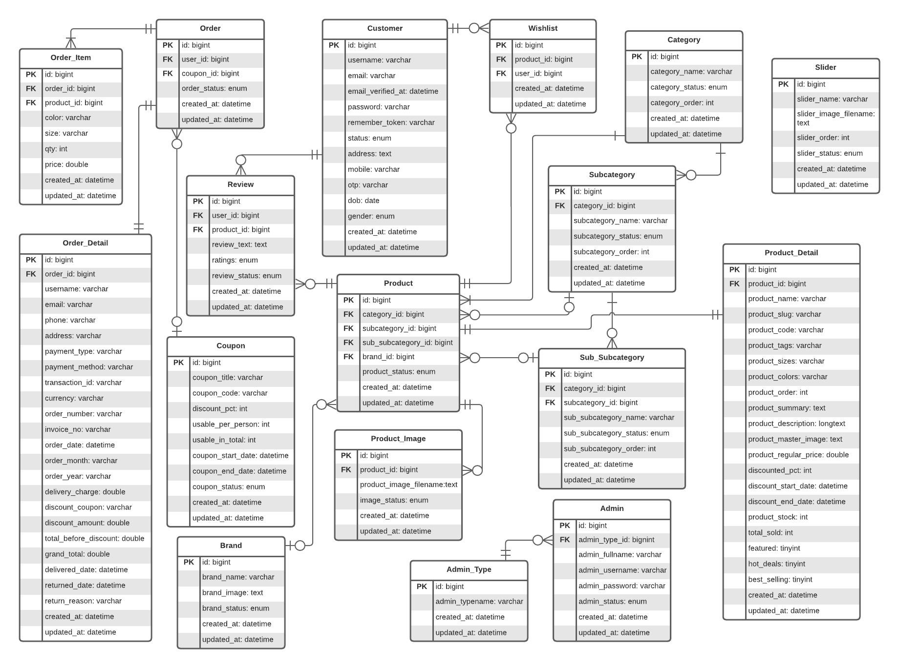
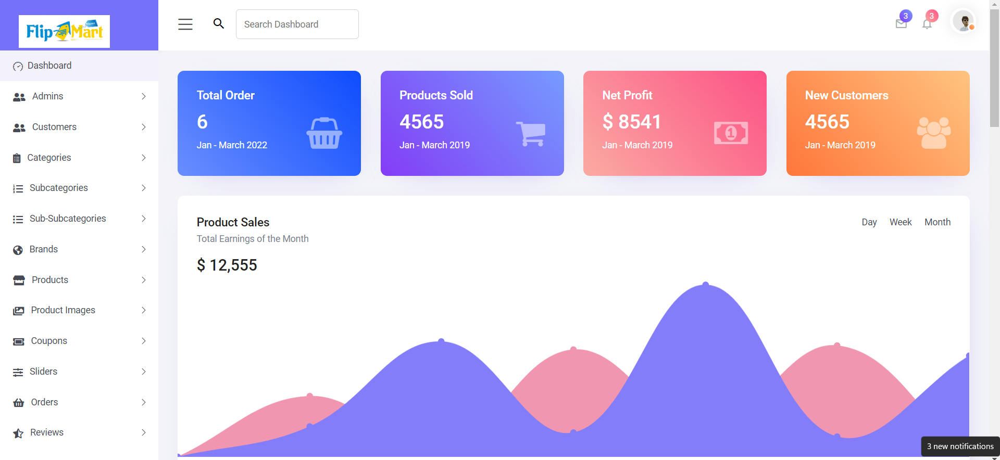
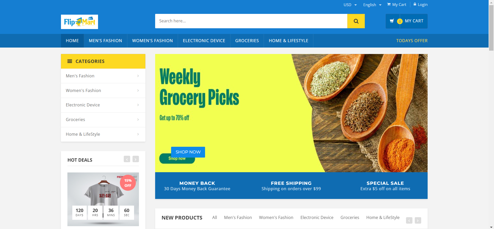

<!--  -->

## About FlipMart

FlipMart is an E-commerce Solution only for deals with buying and selling products. Perform **Multi-Authentication**, Responsive Database Design, and CRUD operations in the system. Integrate Payment Gateway (**Stripe**) and COD for complete order process on purchased products. 

Using Technologies are:
- PHP
- **Laravel**
- JavaScript
- jQuery
- AJAX 
- HTML5, CSS3, Bootstrap, etc.  

## Functional Specification or PRL(Prioritized Requirements List)

1. The system will be able to **authenticate** the customers. (Must Have)
2. The customer can **reset** the previous password. (Should Have)
3. The customer can **easily filter** category and subcategory-wise products. (Must Have)
4. The customer can **smoothly search** the products. (Must Have)
5. The customer can **easily explore** the product details. (Must Have)
6. The customer can **add to the wishlist** of the products. (Should Have)
7. The customer can **add to the cart** of products. (Must Have)
8. The customer can **manage the cart** of the products. (Must Have)
9. The customer can **manage the wishlist** of the products. (Should Have)
10. The customer can **apply coupons** to the cart. (Should Have)
11. The customer can **place an order** of the cart products. (Must Have)
12. The customer can **make payment** by using cash or a card. (Must Have)
13. The customer will be able to **put a review** on the purchased products. (Should Have)
14. The customer can **explore the order status** of the purchased products. (Should Have)
15. The customer can **download the invoice** for the order. (Should Have)
16. The admin will be able to manage products, orders, site settings, etc. (Must Have)

## Entity Relationship (ER) Diagram

## FlipMart Admin DashBoard View

## FlipMart Front-End View

